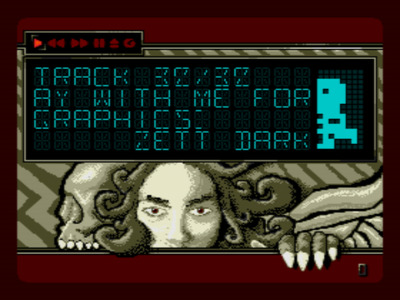
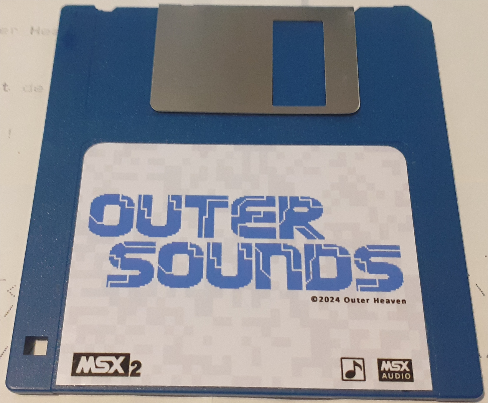

# Outer Sounds - Music Disk

**Outer Sounds** is a music disk for the MSX, created by members of **Outer Heaven** and released in **May 2024**. This collaborative project features original music compositions showcasing the MSX sound capabilities.

---

## Download

**[Download Outer Sounds Disk Image](Outer%20Sounds%20(2024)(Outer%20Heaven).zip)**

The disk image is compatible with MSX 2 systems.

---

## About

Outer Sounds is a musicdisk that demonstrates the creative potential of the MSX platform. Created as a collaborative effort by Outer Heaven members, it features original compositions and visual effects that showcase the unique character of MSX audio and graphics.

---

## Tracklist

This disk contains the following tracks:

- **ARBALEST** - POKE-1,170
- **Battle Scene** - Meits
- **Big in Japan** - Omega 2024
- **Bun Up The Bunker** - Omega 2024
- **Cafe TAS** - Meits
- **Candy Planet** - Meits
- **CENTACOM** - POKE-1,170
- **Coen van der Geest** - Meits
- **Departure Again** - Meits
- **The Prelude** - Meits
- **Flower** - Meits
- **Gianna (Chris Huelsbeck)** - Omega 2024
- **Golden Power** - Meits
- **Holders of Powder** - Meits
- **Hoox** - Meits
- **Journey** - remix by Omega 2024
- **Last Attack** - Meits
- **Zombie Lines** - Meits
- **Thirty Years of Toy Mirrors** - Meits
- **Nightmare Heaven** - Meits
- **Pearlmont Wink** - Meits
- **Medley of the Princess** - Meits
- **POLYBIUS** - POKE-1,170
- **Power of Anger** - Meits
- **Remco Schrijvers** - Meits
- **Magical Sound Shower** - Meits
- **Stuttgart** - Meits
- **The Survivor** - Meits
- **Two Dogs and a Trout** - Omega 2024
- **Reiko in the Light** - Meits
- **A Winters Tale** - Meits
- **Stay with me forever** - Meits

---

## Links

- **[Promotion Website](https://maysixth.file-hunter.com/)** - Official promotion page for MSX Day - MaySiXth (hosted by **[File Hunter](https://www.file-hunter.com/MSX/)**)
- **[MSX.org Wiki Page](https://www.msx.org/wiki/Outer_Sounds)** - Detailed information and documentation
- **[YouTube Video](https://www.youtube.com/watch?v=uHFBsOnwHmI)** - Watch the demo disk in action
- **[Pouët.net Entry](https://www.pouet.net/prod.php?which=97067)** - Scene release page

---

## Credits

Outer Sounds was created by these **Outer Heaven** members:

| Role            | Contributor                                    |
|-----------------|------------------------------------------------|
| **Music**       | Meits, Omega (omegamsx), POKE-1,170 (poke1170) |
| **Graphics**    | Zett Darkstone, Opa                            |
| **Coding**      | tsjakoe                                        |
| **Animations**  | tsjakoe, Zett Darkstone, bitsofbas, GreyFoxNL, FiXato, Quibus |
| **Physical disk** | GreyFoxNL (label by bitsofbas)                |

---

## Release Information

- **Release Date:** May 2024
- **Platform:** MSX 2
- **Type:** Musicdisk

---

## License

This project is provided as-is.

---

Enjoy the sounds of Outer Heaven!

