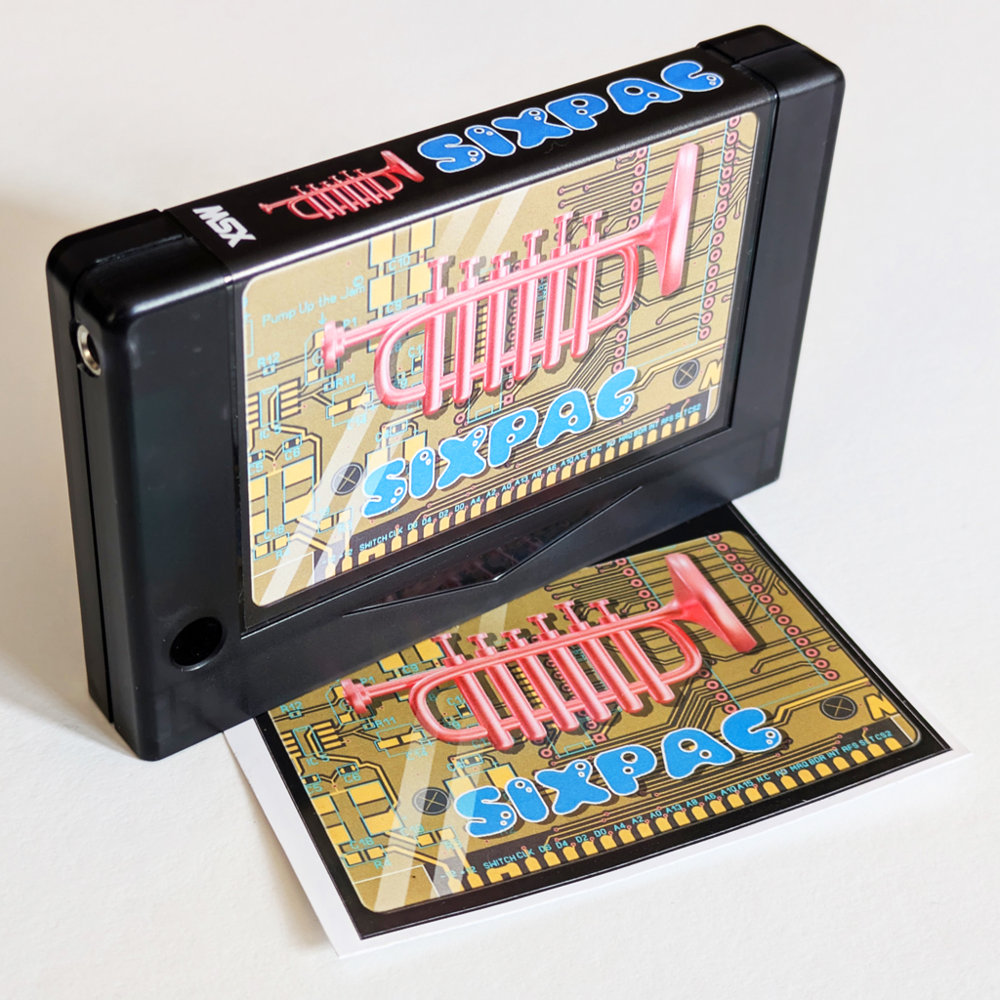
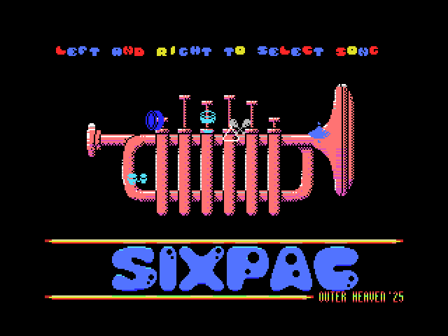

# SIXPAC - The Outer Heaven FM-PAC Clone

Welcome to the **SIXPAC** repository!  
SIXPAC is a modern **FM-PAC** clone for the **MSX**, developed by members of **Outer Heaven**. It features a high-quality line-out, adjustable audio levels, and a few hidden surprises for MSX enthusiasts. 🎶🔥



---

## 📌 Features
- **Original YM2413 sound chip** for warm, authentic FM synthesis.
- **Optimized audio circuit** – Designed to minimize noise, providing the best sound quality via the line-out.
- **Adjustable audio output** via onboard potentiometer (requires access to the PCB).
- **Flashable 64KB ROM** for firmware updates or custom ROMs.
- **Multiple startup options** to access the built-in software:
  - Press `6` during MSX startup to launch SIXPAC.
  - `CALL SIXPAC` to start the built-in ROM.
- **New BASIC commands**:
  - `CALL HELP` for an overview of available commands.
  - `CALL OUTERHEAVEN` to view the credits.
  - `CALL 50HZ` / `CALL 60HZ` to adjust the VDP frequency.



---

## 🛒 Ordering Hardware

Want to get your hands on a physical SIXPAC cartridge? You can preorder one from **SuperSoniqs**:

**[🛒 Preorder SIXPAC from SuperSoniqs](https://shop.supersoniqs.com/en/home/125-sixpac.html)**

The SIXPAC cartridge comes with:
- Cartridge case with sticker
- PCB with genuine YM2413 chip
- Original packaging box
- Built-in ROM with FM tracks and extra BASIC commands

Please note that manufacturing may take some time, and make sure your MSX (or FPGA clone) supports 12V on the cartridge bus.

> **Note:** Please check the [SuperSoniqs store](https://shop.supersoniqs.com/en/home/125-sixpac.html) for exact details regarding pricing, availability, shipping, and specifications.

---

## 🔥 Flashing a Firmware Update

To update the SIXPAC firmware, you can use the tool **WRTSST.COM** written by [HRA!](https://github.com/hra1129), available at [this repository](https://github.com/hra1129/MSX_MegaSCC_for_SST39SF040/tree/main/tools/wrtsst).

### Releases

- **[sixpac-20250121.rom](_archive/sixpac-20250121.rom)** - Initial release.
- **[sixpac-20251230.rom](sixpac-20251230.rom)** - Added SuperSoniqs to the credits.

### Steps to Flash a New Firmware:

1. Download `WRTSST.COM` and copy it to a writable MSX disk or storage device.
2. Place the new [firmware ROM file](sixpac-20251230.rom) in the same directory.
3. Boot into MSX-DOS and run the following command:
   ```
   WRTSST.COM <firmware.rom>
   ```
4. Follow the on-screen instructions to complete the flashing process.
5. Restart your MSX and enjoy the new firmware.

🚠 **Warning:** Flashing incorrect firmware can render the device unusable. Proceed with caution!

---

## 🎧 SIXPAC Sound Quality Showcase

We have recorded some videos so you can check out the sound quality of SIXPAC for yourself:

- [SIXPAC Sound Quality](https://www.youtube.com/playlist?list=PLmK1TPuNv0U2iJQcK8uKBqPqdHRqwttDE) - A playlist demonstrating the authentic FM synthesis of SIXPAC.
- [SIXPAC Sound Quality Comparison](https://www.youtube.com/playlist?list=PLmK1TPuNv0U2qWLUH1MEPOPTKlGjxJHCv) - A rough impression comparing SIXPAC's sound with other FM-PAC solutions. No bad intentions are meant; this is simply for reference.

---

## 👏 Credits
SIXPAC was built with passion by these  **Outer Heaven** members:

| Role                    | Contributor      |
|-------------------------|------------------|
| **Name giver**          | GreyFoxNL        |
| **Incredible solderer** | Jelle Jelsma     |
| **PCB designer**        | Roadfighter      |
| **Programmer**          | tsjakoe          |
| **Luminous designer**   | Zett Darkstone   |
| **Elegant labeler**     | bitsofbas        |
| **Shipping**            | Supersoniqs      |

---

## 🐜 License
This project is provided as-is.

---

## 🤝 Contributing
If you have improvements, suggestions, or bug fixes, feel free to open an issue or submit a pull request.

Enjoy SIXPAC and keep the MSX spirit alive! 🚀

